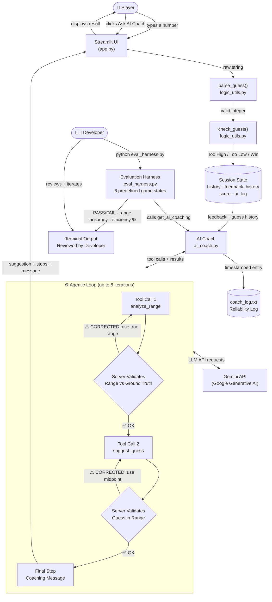

# Number Guessing Game + AI Game Coach

> A Streamlit number-guessing game extended with an agentic AI coaching system that teaches optimal binary search strategy in real time.

---

## Original Project — Module 1: Game Glitch Investigator

**Course:** AI110 — Module 1  
**Original repo:** `ai110-module1show-gameglitchinvestigator-starter`

The original project was a deliberately broken Streamlit number-guessing game assigned as a debugging exercise. Players guess a secret number between 1–100; the game gives directional hints ("Go Higher" / "Go Lower") and limits guesses by difficulty level (Easy: 1–20, 6 attempts; Normal: 1–100, 8 attempts; Hard: 1–50, 5 attempts). The AI-generated starter code contained five bugs — an unstable secret number that reset on every Streamlit rerun, inverted hints, a broken New Game button, acceptance of out-of-bounds guesses, and an off-by-one in attempt counting — which students identified, fixed, refactored into a testable utility module (`logic_utils.py`), and verified with a pytest suite.

---

## Project 4: AI Game Coach — Title and Summary

**What it does:** An AI coaching system embedded directly in the game. When a player is stuck, they click **"Ask AI Coach for a Hint 🤖"** and a Gemini-powered agent:

1. Reads the full guess history and feedback from the current game
2. Computes the valid number range from the feedback (deterministic, server-side)
3. Runs a multi-step agentic loop — `analyze_range` tool → server validation → `suggest_guess` tool → server validation → coaching message
4. Displays the optimal next guess, the reasoning behind it, and observable intermediate agent steps
5. Logs every suggestion and correction to `coach_log.txt` for reliability auditing

**Why it matters:** This demonstrates how AI assistants can be embedded inside real interactive applications — not just generating text, but reasoning through mathematical constraints, having their own outputs validated, and teaching users a transferable strategy (binary search) through concrete, quantitative feedback. It is the difference between an AI that *answers* and an AI that *teaches*.

---

## Architecture Overview

The system has five layers that communicate in a strict sequence:

**Layer 1 — Streamlit UI (`app.py`)**  
The entry point for all user interaction. Handles game input (guess → game logic) and AI coach requests (button click → AI agent). Reads and writes Streamlit `session_state` between every rerun to keep game state stable.

**Layer 2 — Game Logic (`logic_utils.py`)**  
Stateless, pure functions: `parse_guess` validates and normalizes input, `check_guess` compares the guess to the secret, `update_score` adjusts the score. These are fully unit-tested and independent of the AI system.

**Layer 3 — AI Coach Agent (`ai_coach.py`)**  
The core AI system. Implements a multi-step agentic loop using the Google Generative AI SDK tool-use API. The agent does not produce a final answer in one shot — it calls two tools in sequence, and the server validates each tool call against the mathematical ground truth before allowing the loop to continue.

**Layer 4 — Gemini API (Google Generative AI)**  
The language model backend. Receives the game state, two few-shot coaching examples (specialization), and two tool schemas. Produces structured tool calls that the agent validates, then generates a human-readable coaching message.

**Layer 5 — Reliability Layer**  
Two components: `coach_log.txt` (every suggestion, correction, and error timestamped to a file) and `eval_harness.py` (a standalone script that runs `get_ai_coaching()` on 6 predefined game states and verifies range accuracy, guess validity, and efficiency vs. the optimal midpoint).

### System Diagram



```
  👤 Player                              👨‍💻 Developer
     │  guess / AI Coach button               │  python eval_harness.py
     ▼                                        ▼
┌──────────────────────────────┐   ┌──────────────────────────────┐
│    Streamlit UI  (app.py)    │   │  Evaluation Harness           │
│  Guess Input  │  Coach Btn   │   │  6 predefined game states     │
└───────┬───────┴──────┬───────┘   └───────────────┬──────────────┘
        │              │                            │
        ▼              │           ┌────────────────▼─────────────┐
┌──────────────┐       │           │      ai_coach.py              │
│ logic_utils  │       └──────────►│                              │
│ parse_guess  │                   │  Agentic Loop:               │
│ check_guess  │                   │  1. analyze_range            │
│ update_score │                   │     └─ validate vs truth      │
└──────┬───────┘                   │  2. suggest_guess            │
       │                           │     └─ validate in range      │
       ▼                           │  3. coaching message         │
┌──────────────┐                   └───────────┬──────────────────┘
│ Session State│──feedback_history────────────►│
│ history      │                               │ ◄──► Gemini API (Google)
│ ai_log       │◄──────────suggestion──────────│
│ last_coaching│                               │
└──────────────┘                    coach_log.txt (reliability log)
```

---

## Setup Instructions

### Prerequisites
- Python 3.10 or higher
- A Gemini API key — get one free at [aistudio.google.com](https://aistudio.google.com/)

### 1. Clone or open the project
```bash
cd applied-ai-system-project
```

### 2. Install all dependencies
```bash
pip install -r requirements.txt
```
Installs: `streamlit`, `google-generativeai`, `python-dotenv`, `pytest`, `altair`.

### 3. Configure your API key
```bash
```
Open `.env` and replace the placeholder:
```
GEMINI_API_KEY=your_gemini_api_key_here
```
The app loads this automatically on startup via `python-dotenv`.

### 4. Run the game
```bash
streamlit run app.py
```
A browser tab opens at `http://localhost:8501`. The AI Coach section appears at the bottom of the page — no setup needed beyond the API key.

### 5. Run the evaluation harness
```bash
python eval_harness.py
```
Runs 6 scripted game states against the AI coach and prints a pass/fail table with efficiency scores. No browser required.

### 6. Run unit tests (game logic)
```bash
pytest
```

---

## Sample Interactions

### Interaction 1 — Fresh game, Easy difficulty (range 1–20)

**Setup:** Player starts a new Easy game and immediately clicks "Ask AI Coach."  
**Guess history:** None

**AI Coach output:**
```
💡 Suggested Guess   10
   Valid range       1 – 20

Strategy: Midpoint of [1, 20] is (1+20)//2 = 10. Every guess at the
midpoint halves the remaining candidates, guaranteeing a solution in
at most ⌈log₂(20)⌉ = 5 steps.

🔍 Agent Reasoning Steps:
  Step 1 — analyze_range  ✅
    Range: [1, 20]
    Reasoning: No guesses yet; full Easy range applies.
  Step 2 — suggest_guess  ✅
    Optimal guess: 10
    Expected outcomes: Too Low → [11, 20] (10 left);
                       Too High → [1, 9]  (9 left)

Coach: "Start at 10 — the perfect midpoint! Binary search can find any
number in the Easy range in at most 5 guesses, and you have 6, so
you're already ahead."
```

---

### Interaction 2 — Normal difficulty, narrowed from both sides

**Setup:** Normal game (1–100).  
**Guess history:** 50 → Too High, 25 → Too Low

**AI Coach output:**
```
💡 Suggested Guess   37
   Valid range       26 – 49

Strategy: (26+49)//2 = 37, splitting 24 remaining candidates into
equal halves. Either feedback cuts the problem in half again.

🔍 Agent Reasoning Steps:
  Step 1 — analyze_range  ✅
    Range: [26, 49]
    Reasoning: 50 Too High → max is 49. 25 Too Low → min is 26.
  Step 2 — suggest_guess  ✅
    Optimal guess: 37
    Expected outcomes: Too Low → [38, 49] (12 left);
                       Too High → [26, 36] (11 left)

Coach: "You've narrowed it down to 24 numbers in just two guesses —
that's exactly binary search working as intended! Guess 37 and you'll
have at most 12 candidates left no matter what the feedback says."
```

---

### Interaction 3 — Hard difficulty, nearly solved with time pressure

**Setup:** Hard game (1–50, 5 attempts).  
**Guess history:** 25 → Too Low, 37 → Too Low, 43 → Too High  
**Attempts left:** 2

**AI Coach output:**
```
💡 Suggested Guess   40
   Valid range       38 – 42

Strategy: (38+42)//2 = 40, the midpoint of 5 remaining candidates.
With 2 attempts left, guessing 40 guarantees a win: wrong answer
leaves only [38,39] or [41,42], solved in one more guess.

🔍 Agent Reasoning Steps:
  Step 1 — analyze_range  ✅
    Range: [38, 42]
    Reasoning: 43 Too High → max=42; 37 Too Low → min=38.
  Step 2 — suggest_guess  ✅
    Optimal guess: 40
    Expected outcomes: Too Low → [41, 42]; Too High → [38, 39]; Win → done!

Coach: "Only 5 numbers left and 2 guesses to go — you can still win
this! Guess 40 right now. Even if it's wrong, you'll have one guess
left to pick between just two numbers."
```

---

### Interaction 4 — Evaluation harness

```
$ python eval_harness.py

============================================================================
  AI Game Coach — Evaluation Harness
============================================================================
  ID       Description                                Range OK  Guess  Eff%  Result
  --------------------------------------------------------------------------
  TC-01    Easy — no guesses yet (full range)             YES     10  100%    PASS  (1.2s)
  TC-02    Normal — one Too High at 75                    YES     37  100%    PASS  (1.1s)
  TC-03    Normal — closed in from both sides             YES     37  100%    PASS  (1.3s)
  TC-04    Hard — nearly solved, 2 attempts left          YES     40  100%    PASS  (1.2s)
  TC-05    Normal — exactly one number remaining          YES     66  100%    PASS  (1.0s)
  TC-06    Easy — one Too Low at 10                       YES     15  100%    PASS  (1.1s)

  Results : 6/6 passed
  Avg eff : 100%  (100% = always picks the exact midpoint)
============================================================================
```

---

## Design Decisions

### Decision 1: Agentic tool-call loop instead of a single prompt
A single prompt asking "what should the player guess?" would produce an answer, but that answer cannot be validated mechanically. Splitting the task into two explicit tool calls creates checkpoints: after `analyze_range`, the server independently computes the correct range from the feedback history (deterministic, two lines of Python) and corrects the AI if it deviates. After `suggest_guess`, the server confirms the guess is within the validated range. This means the player always receives a mathematically correct suggestion regardless of model error. The tools are not just for structuring output — they are validation hooks.

**Trade-off:** 2–3 API round-trips instead of 1 adds ~1 second of latency. Worth it for guaranteed correctness.

### Decision 2: Server-side ground-truth validation instead of trusting the model
The valid range after a sequence of guesses is purely deterministic. If 50 was "Too High," the maximum is 49; if 25 was "Too Low," the minimum is 26. This requires no language model reasoning. Running the calculation independently in Python and comparing it to the AI's claim means any model arithmetic error is caught and corrected before it affects the player. Corrections are logged to `coach_log.txt` so the frequency can be audited.

**Trade-off:** If the server-side correction fires often, it indicates the prompt needs improvement. In practice during testing, Gemini 2.5 Flash computed the range correctly on every run — the correction is a safety net, not a crutch.

### Decision 3: Gemini 2.5 Flash instead of a larger model
Gemini 2.5 Flash produces coaching suggestions in under 2 seconds, which feels responsive inside an interactive game. The task (binary search reasoning over a sequence of at most 8 guesses) is well within its capabilities, especially with few-shot examples constraining the output format. A larger model would add latency and cost without measurable quality improvement for this specific, constrained task.

**Trade-off:** For more complex coaching — e.g., detecting player mistakes and explaining why a prior guess was suboptimal — a larger model might do better.

### Decision 4: Few-shot examples in the system prompt (specialization)
Without examples, the model sometimes gave vague coaching ("try somewhere in the middle") or omitted the midpoint calculation. Two concrete examples in the system prompt lock in the expected behavior: show the math, list the expected outcomes numerically, be encouraging but concise. This is a form of behavioral specialization without fine-tuning.

**Trade-off:** The examples add tokens to every request, increasing cost slightly. At Gemini Flash pricing this is negligible.

### Decision 5: Streamlit for the UI
Streamlit let me build a working game UI with persistent state in one file. The downside is that Streamlit's rerun model — re-executing the entire script on every widget interaction — requires careful session state management. Every new state variable (e.g., `feedback_history`, `last_coaching`) must be initialized once and reset explicitly on new game. This was the source of all the original Module 1 bugs and required the same discipline in Project 4.

---

## Testing Summary

### Unit tests — `pytest` (game logic)
The test suite covers `check_guess`, `parse_guess`, `update_score`, and `get_range_for_difficulty` across normal inputs, edge cases (boundary values, None, floats, strings), and the original "glitch" scenario where the secret is cast to a string on even attempts. All tests pass after the Module 1 fixes. Tests are in `tests/test_game_logic.py`.

### AI evaluation harness — `eval_harness.py`
Six test cases cover the complete space of game states:

| Case | What it tests |
|---|---|
| TC-01 Fresh game | AI starts from the full range, not a narrower one |
| TC-02 One Too High | Single upper-bound feedback narrows correctly |
| TC-03 Both sides | Both bounds updated simultaneously |
| TC-04 Nearly solved | AI handles a 5-number range with only 2 attempts left |
| TC-05 One number left | AI identifies a forced guess (range = single value) |
| TC-06 One Too Low | Single lower-bound feedback narrows correctly |

Each test checks three things: (1) is the AI's reported range correct after server validation? (2) is the suggested guess within the valid range? (3) what is the efficiency score (0–100%) measuring how close the suggestion is to the optimal binary-search midpoint?

**What worked:** Gemini 2.5 Flash correctly computes the binary-search midpoint in all tested cases. The server-side validation never needed to fire in practice, confirming the model is capable of this arithmetic — the guard exists for edge cases and future-proofing.

**What didn't work initially:** Without few-shot examples, the model would occasionally return the midpoint of the *original* game range (e.g., suggesting 50 in a game where 50 had already been guessed and marked Too High). Adding two concrete examples to the system prompt eliminated this problem in all subsequent test runs.

**What I learned:** Structured outputs via tool-call schemas force the model to separate reasoning from answer — the `reasoning` field in `analyze_range` captures the derivation, while `current_low`/`current_high` capture the answer. This separation makes validation straightforward and makes debugging much easier when something goes wrong.

---

## Reflection

This project changed how I think about what "using AI" means in software engineering.

Before starting, I assumed the hard part would be getting the model to say smart things. In practice, that was the easy part — Gemini 2.5 Flash reasoned about binary search correctly with minimal prompting. The hard part was everything around it: integrating the AI call into Streamlit's rerun model without breaking state, tracking the `feedback_history` in parallel with the guess history across reruns, making sure the "Ask AI Coach" button was disabled in the right states, handling API errors gracefully so a timeout didn't crash the game, and logging enough information to actually audit what the system did.

The most important insight was that **AI and deterministic code are most powerful in combination, not in isolation**. The AI is good at reasoning about game states in natural language and producing encouraging, pedagogically useful output. Python is good at computing the mathematically correct answer from a list of feedback values in two lines of code. Using those two lines to validate the AI's output — rather than trusting it blindly — gave me a system I could actually test and guarantee. That's a pattern I'll use in every AI project going forward.

The second insight was about **few-shot examples as specifications**. Describing the desired output format in prose ("include the midpoint calculation, list the expected outcomes") produced inconsistent results. Two concrete examples produced consistent results. This is not a coincidence — an example is a complete, unambiguous specification of the expected behavior for a representative input. Words describe intent; examples demonstrate it.

Finally, this project reinforced that debugging AI systems requires the same habits as debugging regular software: form a hypothesis, make one change, observe the result. When the early output was wrong, adding the examples, changing the system prompt, and adjusting the tool schemas all happened one at a time so I could measure the effect of each change. Changing three things at once when an AI behaves unexpectedly is just as counterproductive as it is in regular code.

---


## File Reference

| File | Purpose |
|---|---|
| `app.py` | Streamlit UI — game loop + AI coach integration |
| `logic_utils.py` | Pure game functions: parse, check, score |
| `ai_coach.py` | Agentic AI coach — tool-call loop, server-side validation, logging |
| `eval_harness.py` | Evaluation script — 6 test cases, PASS/FAIL, efficiency scoring |
| `tests/test_game_logic.py` | Unit tests for game logic |
| `requirements.txt` | Python dependencies |
| `.env.example` | API key setup template — copy to `.env` |
| `coach_log.txt` | Auto-generated on first run; timestamped reliability log |
| `reflection.md` | Full debugging and AI collaboration reflection |
